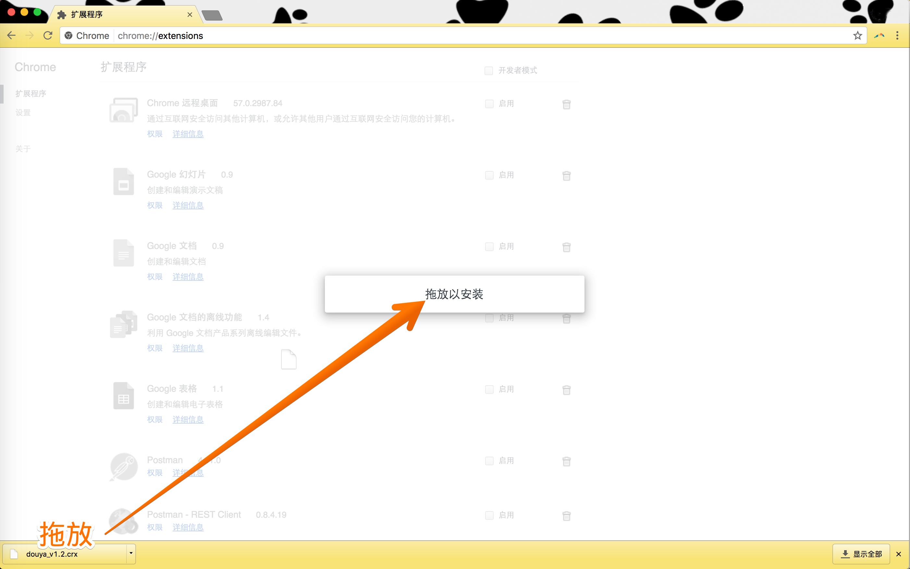
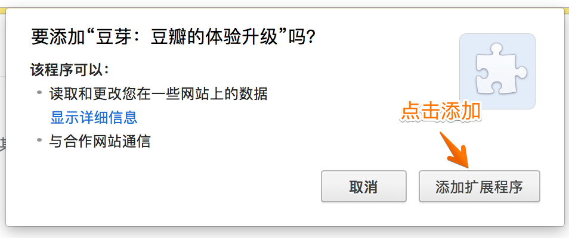
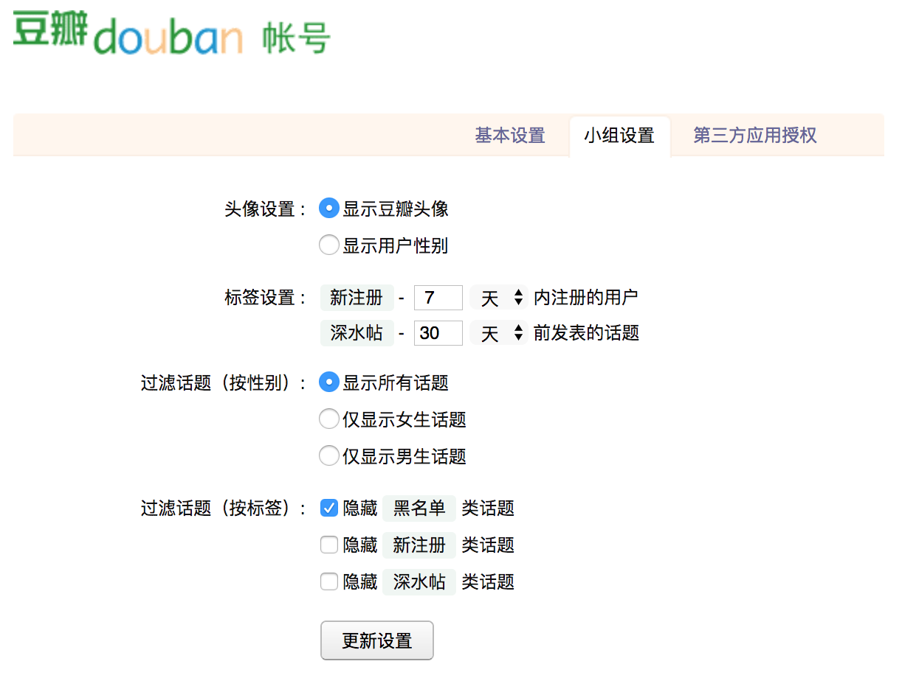

# 豆芽是什么？
> 豆芽是一款为专门为豆瓣设计的浏览器扩展程序，它的目标是让大家更加安全、优雅、愉快的浏览豆瓣。目前，我们已经针对 **豆瓣小组** 做了以下改进，欢迎使用：

* 用户无需翻页浏览，向下滚动页面即可加载更多话题
* 屏蔽侧边栏广告，显示话题作者以及性别等更多信息
* 自动标签，识别新注册用户、黑名单用户等
* 支持按照作者性别对话题进行过滤（只看男生，只看女生）
* 支持按照标签对话题进行过滤（不看黑名单用户发的帖子）

# 安装说明

> 豆芽目前仅提供对 **谷歌浏览器** 和 **360浏览器** 的支持，请您在安装前留意自己的浏览器版本。

## 谷歌浏览器
由于一些政策原因，我们在国内无法访问谷歌浏览器的官方应用商店，但是没有关系，我们可以通过下面简单的几步来手动安装！

1、点击 [这里](https://github.com/haoxi911/douya/raw/master/release/douya_v1.2.crx) 下载豆芽的最新版安装包。

2、点击浏览器右上角灰色按钮，选择更多工具，选择扩展程序。

{:height="50%" width="50%"}

3、选择屏幕左下方的安装包，拖到屏幕空白页，拖放以安装。

{:height="80%" width="80%"}

4、点击“添加”完成安装。

{:height="80%" width="80%"}

## 360安全浏览器

360安全浏览器的安装比较简单，只需使用360浏览器访问本网页，点击 [这里](https://github.com/haoxi911/douya/raw/master/release/douya_v1.2.crx) 即可，浏览器会自动安装最新版的豆芽。

好了，安装成功！登陆你的豆瓣，打开 [豆瓣小组](https://www.douban.com/group/) 试试看吧！

# 小组设置

> 豆芽针对豆瓣小组提供了一些设置选项，您可以登陆到您的豆瓣帐号，在“帐号管理”里面选择“小组设置”页面，即可看到如下页面：

{:height="80%" width="80%"}

更改选项后，别忘了保存设置。新的设置会在刷新页面后生效！

# 隐私声明
豆芽不会收集您的隐私数据，您只需确保通过访问本 [网址](https://haoxi911.github.io/douya/) 下载原版软件，即可以放心使用。

如果您有任何问题可以发 [豆油](https://www.douban.com/doumail/write?to=101845695) 给我，或者在项目的 [问题](https://github.com/haoxi911/douya/issues) 页面留言。
