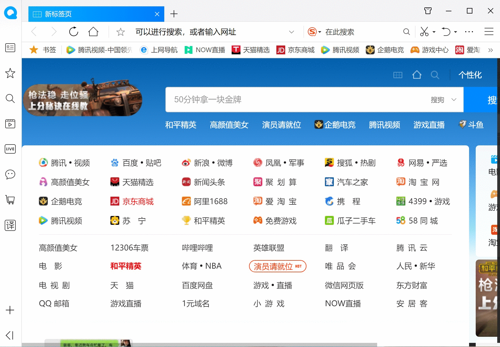
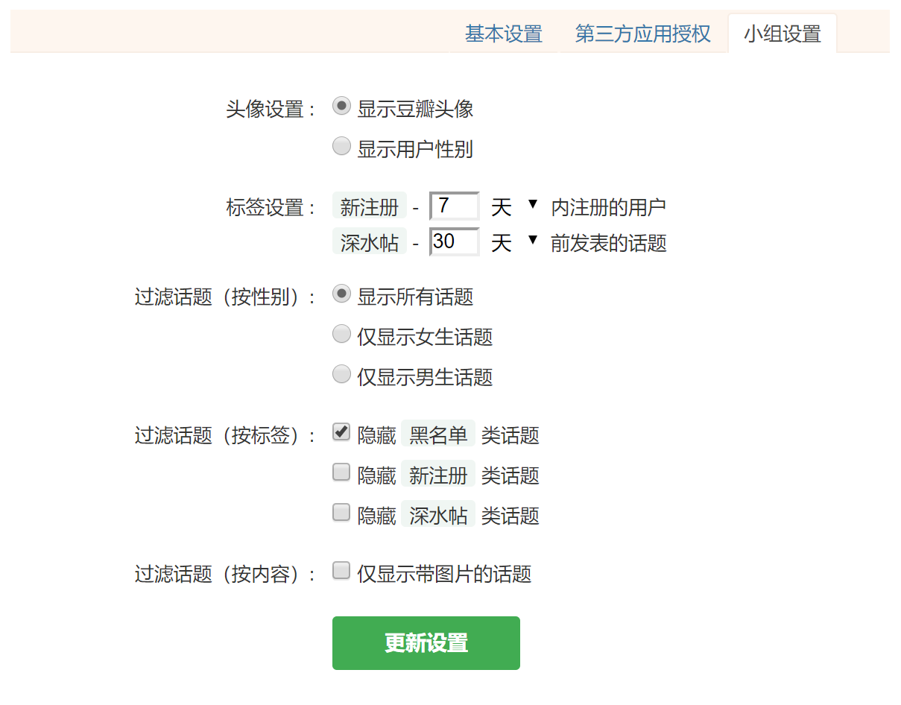

# 豆芽是什么？
> 豆芽是一款为专门为豆瓣设计的浏览器应用程序，它的目标是让大家更加优雅、愉快的使用豆瓣。目前，我们已经针对 **豆瓣小组** 做了以下改进，欢迎使用：

* 用户无需翻页浏览，向下滚动页面即可加载更多话题
* 屏蔽侧边栏广告，显示话题作者以及性别等更多信息
* 用户标签，自动识别新注册用户、黑名单用户等
* 支持按照作者性别对话题进行过滤（只看男生，只看女生）
* 支持按照标签对话题进行过滤（不看黑名单用户的帖子）
* 支持按照内容对话题进行过滤（只看带图片的帖子）

# 安装说明

> 豆芽支持**QQ浏览器**、**360浏览器**、**谷歌浏览器**等主流浏览器。豆芽支持**Windows**、**macOS**、**Linux**等操作系统。如果你不清楚自己的浏览器是否被支持，可以 [**豆邮**](https://www.douban.com/doumail/write?to=101845695) 给我，我会及时回复。

> 2019-10-22：豆芽目前不支持**搜狗浏览器**、**世界之窗浏览器**，请在安装前留意自己的浏览器版本。

## QQ浏览器

1、打开QQ浏览器，点击 [**这里**](https://appcenter.browser.qq.com/search/detail?key=%E8%B1%86%E8%8A%BD&id=okbegmdpgiceefipdjigeebadkehcpil%20&title=%E8%B1%86%E8%8A%BD%EF%BC%9A%E8%B1%86%E7%93%A3%E5%B0%8F%E7%BB%84%E7%9A%84%E4%BD%93%E9%AA%8C%E5%8D%87%E7%BA%A7) 进入应用中心。

2、点击“立即安装”，待系统显示“已安装”，点击豆芽图标，开始使用。

## 360浏览器

1、打开360浏览器，点击 [**这里**](https://github.com/haoxi911/douya/raw/master/release/douya_v2.0.crx) 下载本程序。

2、打开下载管理器，打开安装文件，确认安装。

3、点击豆芽图标，开始使用。

## 谷歌浏览器

1、打开谷歌浏览器，点击 [**这里**](https://github.com/haoxi911/douya/raw/master/release/douya_v2.0.crx) 下载本程序。

2、点击浏览器右上角灰色按钮，选择更多工具，选择扩展程序。

3、启动开发者模式，并刷新当前页面（**重要**）。

4、将安装文件拖拽到应用管理器，确认安装。

5、点击豆芽图标，开始使用。

> 熟悉科学上网的同学，也可以点击 [**这里**](https://chrome.google.com/webstore/detail/okbegmdpgiceefipdjigeebadkehcpil) 进入谷歌浏览器的应用商店进行安装。

# 小组设置

> 豆芽针对豆瓣小组提供了一些设置选项，您可以在登陆豆瓣小组后，在“帐号管理”里面下选择“小组设置”：

更改选项后，别忘了点击“更新设置”。新的设置会在页面刷新后生效！

# 隐私声明
豆芽不会收集您的隐私数据，您只需确保通过访问本 [**网址**](https://haoxi911.github.io/douya/) 下载原版软件，即可以放心使用。

如果您有任何问题可以发 [**豆邮**](https://www.douban.com/doumail/write?to=101845695) 给我，或者在项目的 [**问题**](https://github.com/haoxi911/douya/issues) 页面留言。
